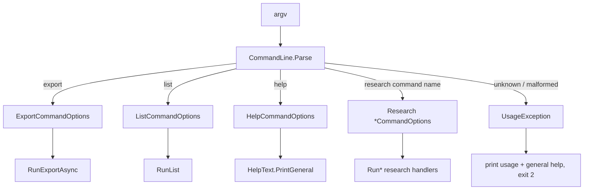
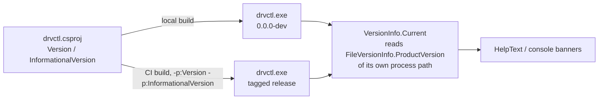
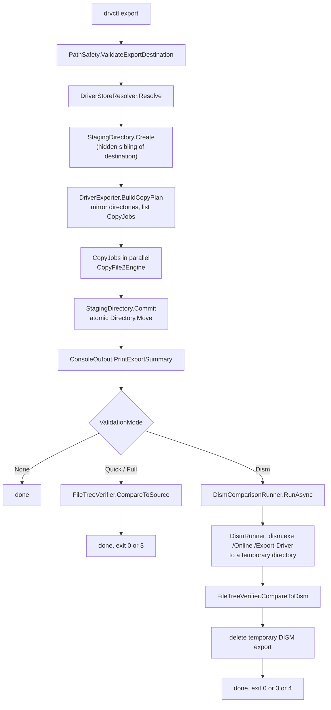
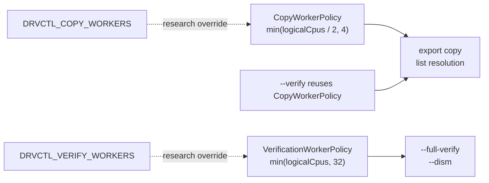

# Architecture

This is the technical map of drvctl as it actually exists in the repository
today. See [`PHILOSOPHY.md`](PHILOSOPHY.md) for why it's built this way, and
[`SPEC.md`](SPEC.md) for the exact production contract.

## CLI dispatch

Every invocation flows through the same two files. `Cli/CommandLine.cs`
parses `argv` into a typed `CommandOptions`. `Cli/DrvCtlApp.cs` dispatches on
that type and runs the command.

`CommandLine.Parse` recognizes every command by exact name, public and
research alike. `HelpText` only knows about `export`, `list`, and `help`.
That's the entire mechanism behind "hidden from discovery": a command that
exists in the dispatch switch but not in the help renderer. Nothing enforces
that boundary beyond the two files agreeing to keep it, so `AGENTS.md` says
it in plain words too.

## Public vs research commands

| Command | Surface |
|---|---|
| `export` | public |
| `list` | public |
| `help` | public |
| `inspect-inf`, `inspect-wim`, `plan-driver`, `validate-plan` | research |
| `simulate-apply`, `analyze-publication` | research |
| `prototype-publication`, `prototype-inject-wim` | research |

The research commands live in `src/drvctl/Cli/DrvCtlApp.cs` alongside the
public ones (they share the same dispatch table) but their supporting code
lives in `src/drvctl/{Drivers,Images,Registry}` for the parts shared with
production, and in `Research/` for the parts that are purely experimental
(publication planning, offline apply simulation, WIM injection prototypes).

## Version metadata flow

`drvctl.csproj` is the single source of truth. Locally it carries a
`0.0.0-dev` placeholder so help output always shows something valid.
`.github/workflows/publish.yml` builds tagged releases (CalVer tags like
`2026.08.17` or `2026.08.17-rc1`) and passes the real values in through
MSBuild properties: `-p:Version` (the build/package-safe numeric form) and
`-p:InformationalVersion` (the exact human-facing tag text, which can carry
a `-rc1` suffix that `Version` cannot). At runtime, `Core/VersionInfo.cs`
reads its own `ProductVersion` back out of the built executable via
`FileVersionInfo`, because Native AOT single-file builds don't expose a
usable `Assembly.Location` to read it from assembly metadata directly. There
is no source-text substitution step anymore. CI never rewrites a file to
bake in a version string, it just passes MSBuild properties.

## list flow

`list` never copies a file, never calls DISM, and never verifies anything.
It's a read of what SetupAPI already knows.

## export flow

If any copy fails partway through, the whole staging directory is deleted
(`StagingDirectory.Dispose`) and nothing partial is left at the destination.
That's what makes export all-or-nothing: files land in a hidden sibling
directory first, and only a clean run commits it into place with a single
atomic move.

## SetupAPI / Driver Store resolution

`Drivers/DriverStoreResolver.cs` is the one place both `export` and `list`
depend on. It enumerates `%WINDIR%\INF\oemNN.inf`, then calls
`SetupGetInfDriverStoreLocationW` per file (in parallel, using
`CopyWorkerPolicy`) to resolve each published INF to its real package
directory under `DriverStore\FileRepository`. `list --verbose` additionally
reads identity fields (Provider, Class, Version, ...) through
`InfInspector.InspectIdentity`, on a best-effort basis: a package still
resolves even if identity reading fails, because identity is a display
nicety, not a resolution requirement.

## CopyFile2 and the copy plan

`Copy/CopyFile2Engine.cs` calls the Win32 `CopyFile2` API directly rather
than `System.IO.File.Copy`, so a failure surfaces as the real Win32 error
code (a path-too-long error gets a specific, actionable hint) instead of a
generic `IOException`. `Export/DriverExporter.BuildCopyPlan` mirrors every
package directory's structure under the staging root up front, so the
parallel copy phase never has to race on directory creation, it only copies files.

## Automatic worker policies

There is no public `--workers` flag. Copying and hashing are different
workloads, so they get different automatic policies, both implemented in
`Cli/DrvCtlApp.cs`. Copy concurrency is deliberately small, benchmarking
showed that a larger copy pool made export slower, not faster. Quick
verification (`--verify`) is metadata-only, so it reuses the copy policy
rather than getting its own. Full verification and DISM comparison hash
every file, which scales with cores much better than copying does, so they
get their own wider policy. `DRVCTL_COPY_WORKERS` and `DRVCTL_VERIFY_WORKERS`
are internal research and benchmarking overrides, not CLI options. When one
is set, `--verbose` labels the resulting worker count as "environment
override" instead of "automatic," so verbose output never claims an
override was a normal decision.

## Verification model

`Verification/FileTreeVerifier.cs` is the shared comparison engine behind
all three validation modes. It builds a fingerprint tree (relative path,
size, and optionally SHA-256) for each side of a comparison, then diffs the
two trees by path. `VerificationDepth.Quick` skips hashing, `Full` includes
it. `CompareToSource` compares an export against the Driver Store packages
it was copied from and never touches DISM. `CompareToDism` always hashes,
since the caller (`Verification/DismComparisonRunner.cs`) already paid the
cost of running DISM. `DismComparisonRunner` is the only place in the whole
CLI that touches DISM: it creates a temporary reference export, hands it to
`FileTreeVerifier`, and deletes it again in a `finally` block regardless of
outcome.

Console rendering for all three modes lives separately in
`Utilities/ConsoleOutput.cs`, so the comparison logic itself never touches
`Console.WriteLine`.

## Benchmarking

`Benchmarking/BenchmarkPrinter.cs` renders `--benchmark` output: a timing
breakdown of the export phases, and (with `--dism --benchmark`) a
side-by-side comparison against DISM's own timing. That comparison is
explicitly flagged as warm-cache, since drvctl's own export always runs
first and can leave the filesystem cache warm for the DISM reference export that follows.
`Platform/CacheFlusher.cs` exists to support a real cold-cache benchmark
(it drops the Windows system file cache via `SetSystemFileCacheSize`) but
isn't currently wired into any command.

## Console rendering

`Utilities/ConsoleOutput.cs` owns the friendly-by-default,
verbose-for-detail split for every command. `HelpText.cs` owns everything
printed for `help`, `export --help`, and `list --help`, and only those three
public surfaces, research commands have no help text by design.

## Native interop boundaries

| File | Library | Used by |
|---|---|---|
| `Native/SetupApiNative.cs` | setupapi.dll | `list`, `export` (via `DriverStoreResolver`), `inspect-inf`, `plan-driver` |
| `Native/Kernel32Native.cs` | kernel32.dll | `export` (`CopyFile2`), `CacheFlusher` |
| `Native/Advapi32Native.cs` | advapi32.dll | `CacheFlusher` (token privilege adjustment) |
| `Native/WimlibNative.cs` | native\libwim-15.dll (bundled) | `inspect-wim`, `prototype-inject-wim` |
| `Native/OffregNative.cs` | offreg.dll | `simulate-apply`, `analyze-publication` |

Every P/Invoke declaration uses the explicit `W` (wide/UTF-16) export where
Windows offers both an `A` and `W` variant. Most use source-generated
`[LibraryImport]`, the one exception is `SetupVerifyInfFileW`, which carries
fixed-size inline string buffers (`SP_INF_SIGNER_INFO_V2`) that the
source-generated marshaller doesn't support, so it stays on classic
`[DllImport]`. Handles that need deterministic cleanup (`SafeWimHandle`,
`SafeOfflineHiveHandle`, `SafeOfflineKeyHandle`) are `SafeHandle`
subclasses, not raw `nint` fields with manual `Dispose` bookkeeping.

## Research boundary

Everything under `Research/` (publication planning, offline apply
simulation, WIM injection prototypes, encoding studies) exists to answer
questions about how Windows driver servicing actually works. It is
reachable from the CLI through the hidden research commands, but it is not
part of the supported product. `docs/` holds the accumulated research notes
and experiment history. See `AGENTS.md` for the working rules that keep
research and production from bleeding into each other.
